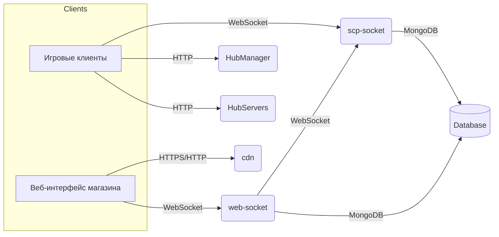

# scpsl-shop-old-prod-until-2023 🌐🛒

[](https://github.com/Shiro-nn/scpsl-shop-old-prod-until-2023/stargazers)
[](https://github.com/Shiro-nn/scpsl-shop-old-prod-until-2023/network/members)
[](https://github.com/Shiro-nn/scpsl-shop-old-prod-until-2023/issues)
[](https://github.com/Shiro-nn/scpsl-shop-old-prod-until-2023/commits)
[](LICENSE)
[](https://github.com/Shiro-nn/scpsl-shop-old-prod-until-2023)


> **scpsl-shop-old-prod-until-2023** — это старая версия сайта магазина для игрового проекта SCPSL, которая использовалась в продакшене. Разработка началась в третьем квартале 2020 года (Q3 2020), обновления вносились до первого квартала 2023 года (Q1 2023), после чего проект был переведён в архивный режим. Репозиторий представляет собой набор микросервисов, обеспечивающих работу магазина, и сохранён в открытом доступе "как есть" — без дальнейшей поддержки или обновлений.

---

## 📂 Состав репозитория

На основе анализа `diff.txt` репозиторий включает следующие компоненты:

| Директория       | Язык/стек                                          | Краткое описание                                                                                   |
|------------------|----------------------------------------------------|----------------------------------------------------------------------------------------------------|
| **`HubManager`** | **Node.js** (`express`)                            | Сервис управления IP-адресами пользователей (добавление/получение по UserID).                     |
| **`HubServers`** | **Node.js** (`express`, `child_process`)           | Управление сетевыми настройками через `iptables` и `ipset` для серверов SCPSL (NAT, фильтрация).  |
| **`cdn`**        | **Node.js** (`express`, `multer`, `imagemin`)      | CDN-сервис для загрузки и оптимизации файлов (например, GIF), с поддержкой HTTPS и кэширования.   |
| **`scp-socket`** | **Node.js** (`qurre-socket`, `mongoose`)           | WebSocket-сервер для взаимодействия с игровыми серверами, управление данными в MongoDB.           |
| **`web-socket`** | **Node.js** (`socket.io`, `mongoose`, `ipinfo`)    | WebSocket-сервер для веб-интерфейса магазина, включая управление сессиями и геолокацией.          |

> **Примечание:** Каждый сервис запускается независимо, имеет собственный `package.json` и конфигурационные файлы (например, `cdn.config.js`, `socket.config.js`).

---

## 🚀 Быстрый старт (локально)

### Общие требования
- Установите **Node.js 18+** и **npm**.
- Настройте **MongoDB 6+** для сервисов, использующих базу данных (`scp-socket`, `web-socket`).
- Убедитесь, что у вас есть доступ к портам, указанным в коде.

#### HubManager
```bash
git clone https://github.com/Shiro-nn/scpsl-shop-old-prod-until-2023.git
cd scpsl-shop-old-prod-until-2023/HubManager
npm install
node hub.js
```
- Запускается на порту `4536` (локально и на `10.66.55.2`).

#### HubServers
```bash
cd ../HubServers
npm install
node init.js  # или init-nat.js для NAT-настроек
```
- Запускается на порту `5231`. Требуются права для выполнения `iptables` и `ipset`.

#### cdn
```bash
cd ../cdn
npm install
node cdn.js
```
- HTTP на `2653` (localhost), HTTPS на `2521`. Требуется файл `crt.js` с SSL-сертификатами.

#### scp-socket
```bash
cd ../scp-socket
npm install
node socket.js
```
- Запускается на порту `2467`. Настройте `config.js` с IP и MongoDB URI.

#### web-socket
```bash
cd ../web-socket
npm install
node init.js
```
- Запускается на порту `2345` (localhost). Настройте `config.js` с MongoDB URI.

> **Примечание:** Для работы HTTPS в `web-socket` раскомментируйте код в `socket.init.js` и добавьте SSL-сертификаты в `crt.js`.

---

## 🧩 Мини-архитектура



- **HubManager**: Хранит и предоставляет IP-адреса пользователей.
- **HubServers**: Управляет сетевыми правилами для игровых серверов.
- **cdn**: Обслуживает статические файлы с оптимизацией.
- **scp-socket**: Связывает игровые серверы с базой данных через WebSocket.
- **web-socket**: Обеспечивает взаимодействие веб-интерфейса с сервером и базой данных.

---

## 🛠️ Системные требования

- **Node.js 18+** и `npm` для всех сервисов.
- **MongoDB 6+** для `scp-socket` и `web-socket`.
- **PM2** (опционально) для управления процессами (используется в `cdn` и `scp-socket`).
- Права на выполнение `iptables` и `ipset` для `HubServers` (Linux).
- SSL-сертификаты для HTTPS в `cdn` и `web-socket` (опционально).

---

## 🤝 Вклад

Репозиторий **архивирован** (Q1 2023), поэтому Pull Requests принимаются только для критических исправлений ошибок или обновления зависимостей. Для дальнейшего развития — создавайте форки и экспериментируйте самостоятельно.

---

## ⚖️ Лицензия

Код распространяется под лицензией **MIT**. Используйте свободно, но без каких-либо гарантий поддержки или работоспособности.

> Спасибо за интерес к проекту! Надеюсь, этот архивный код будет полезен для изучения или вдохновения в ваших собственных разработках. ❤️
